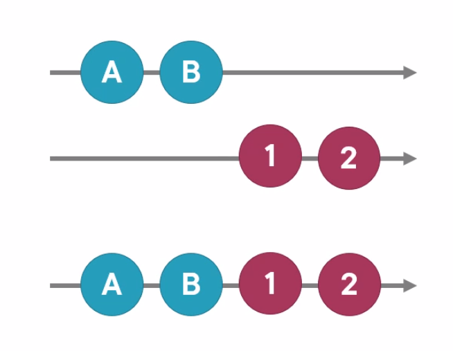

# RxJS - notatki

## 1. Podstawy i definicje

### Observable

Observable to strumień, który emituje wartości (pojedyncze lub wiele) dowolnego typu do którego możesz się podłączyć oraz od niego odłączyć. Można na niej używać operatorów. Używa się na nim subscribe() żeby observer mógł nasłuchiwać wyemitowanych wartości

### Observer

Observer to obiekt który obserwuje i odpowiada na powiadomienia dostarczone przez Observable.

Inna definicja to że observer to odbiorca wartości dostarczanych przez Observable.

Robi to takimi metodami jak:

- next() - obsługuje następne wyemitowane wydarzenie
- error() - obsługuje błędy
- complete() - powiadomienie o skompletowaniu observable

### Subscriber

Każdy Observer jest konwertowany na Subscriber czyli Observer który może od-subskrybować od Observable.

### Subscribe

Observer nie otrzyma danych albo observable nie zacznie przesyłać danych dopóki nie zasubskrybuje do Observable. Na tej podstawie rozróżnia się

- hot observable- czyli taka która nie czeka na subscribe i może emitować wartości mimo że nikt do niej nie zasubskrybował a każdy subscriber dzieli strumień danych
- cold observable - czyli taka która nie emituje wartości dopóki się do niej nie zasubskrybuje a każdy subscriber ma swój strumie danych

### Unsubscribe

Żeby przestać słuchać wartości emitowanych przez observable wywołujemy unsubscribe na subskrypcji, co zapobiega wyciekowi danych w aplikacji. Można to zrobić w następujący sposób:

- wywołując metodę `complete()`
- używając operatorów które kończą się automatycznie
- poprzesz wyrzucenie błędu
- wywołując `unsubscribe()`; należy przypisać do zmiennej observable na której wywołujemy subscribe, która zwróci typ subscribe i użyć na tej zmiennej metody unsubscribe

### Shedulers

Sposób na kontrolowanie strategii czasowej używanej do wykonywania zadań w RxJS. Używamy jej kiedy chcemy wywołać synchroniczną Observable asynchronicznie. np prost of czy from.

Należy do nic np scheduler _delay_

```tsx
import { of, asyncScheduler, asapScheduler } from 'rxjs';
import { observeOn } from 'rxjs/operators';
const observableOne = of('observableOne');
const observableTwo = of('observableTwo');

console.log(1);
observableTwo.pipe(observeOn(asyncScheduler)).subscribe(console.log); // asapScheduler performs macro task
observableOne.pipe(observeOn(asapScheduler)).subscribe(console.log); // asapScheduler performs micro task -
// runs first, before macro tasks such as setTimeout()
console.log(2);

/*
  console output:
    1
    2
    observableOne
    observableTwo
*/
```

### Tworzenie Observable - of() i from() creation functions

W rxjs można stworzyć observable za pomocą:

- konstruktora

```jsx
const observable = new Observable((subscriber) => {
  subscriber.next(1);
  subscriber.next(2);
  subscriber.next(3);
});
```

- funkcja of(), która tworzy observable i emituje elementy przekazane jako parametry a później się kończy - nie ma potrzeby od subskrybować

```jsx
of(1, 2, 3);
```

- funkcja from(), która tworzy observable z tablicy

```jsx
from([1, 2, 3]);
```

## 2. RxJS operators

Operatory to funkcje w RxJS, które dzielimy na 2 grupy:

- **Pipeable Operators**, czyli takie któr używamy na istniejącej observable w pipe, bierze ona pierwotną observable i zwraca nowa - zmodyfikowaną np. poprzez użycie map, filter czy merge map
- **Creation Operators** , np of(), czy from() czyli takie, które mogą byc wywłane jako nizależne funkcje tworząc nowe Observable

### map()

Operator map() służy do zmiany każdej wartośći przekazanej do observable na podstawie logiki przekazanej wewnątrz map(). Dla każdego elemntu zwraca nową, zmienioną observable.

```tsx
import { from, map } from 'rxjs';

from([1, 2, 3, 4, 5, 6])
  .pipe(map((el) => el * 2))
  .subscribe(console.log);

// console output: 2, 4, 6, 8, 10, 12
```

### tap()

Operator tap() służy do wykonywania operacji które nie pływają na emitowane elementy. Jego output observable jest zawsze identyczna input observable. Przydaje się przy debugowaniu czy wykonowyania akcji które mają być efektem ubocznym, np ziwększanie countera poza observable czy ustawianie zmiennej boolean mającej włączać/wyłączać spinner

```tsx
import { of, map, tap } from 'rxjs';

let counter = 0;

of(1, 2, 3, 4, 5, 6)
  .pipe(
    map((el) => el * 2),
    tap(() => counter++),
    map((el) => el - 1),
    tap((el) => console.log(el))
  )
  .subscribe({
    complete: () => console.log('counter = ', counter),
  });

//console output: 1, 3 ,7 9, 11
//counter = 6
```

### take()

Take emituje tylko określona liczbę elemntów określoną przez observabel, przydaje się np kiedy potrzbujemy tylko kiklu pierwszych wartości. Kończy się (jest complete) jeśli przyjmie wystarczającą ilość elementów

```tsx
import { of, map, take } from 'rxjs';

of(1, 2, 3, 4, 5, 6)
  .pipe(
    map((el) => el * 2),
    take(2),
    map((el) => el - 1)
  )
  .subscribe(console.log);

// console output: 1, 2
```

## 3. Reaktywne podejście do zarządania sybskrypcjami

### async pipe

Async pipe pozwala na prostszą obsługę observables w widoku aplikacji. Nie trzeba subskrybować i odsybskrybowywać w pliku ts wystarczy to zrobić w pliku .html, a unsubscribe będzie automatyczne.

**przed:**

```tsx
export class ProductListComponent implements OnInit, OnDestroy {
  pageTitle = 'Product List';
  errorMessage = '';
  categories: ProductCategory[] = [];

  products: Product[] = [];
  sub!: Subscription;

  constructor(private productService: ProductService) {}

  ngOnInit(): void {
    this.sub = this.productService.getProducts().subscribe({
      next: (products) => (this.products = products),
      error: (err) => (this.errorMessage = err),
    });
  }

  ngOnDestroy(): void {
    this.sub.unsubscribe();
  }
}
```

**po:**

```tsx
export class ProductListComponent implements OnInit {
  pageTitle = 'Product List';
  errorMessage = '';
  categories: ProductCategory[] = [];

  products$: Observable<Product[]> | undefined;

  constructor(private productService: ProductService) {}

  ngOnInit(): void {
    this.products$ = this.productService.getProducts();
  }
}
```

**W pliku .html systarczy użyć aync pipe:**

```html
<table class="table mb-0" *ngIf="products$ | async as products">
  <!-- 'products' as normal variable  -->
</table>
```

### handling errors

Błędy w rxjs można łapać za pomocą operatorów

- przy użyciu error function

```jsx
this.beerService.getBeers().subscribe({
  next: (beers) => {
    console.log(beers);
    this.beers = beers;
    this.title = beers[0].name;
  },
  error: (e) => {
    console.log(e);
    this.title = 'ups';
  },
  complete: () => console.log('done'),
});
```

- catchError() - operator który łapie błąd, ale emituje nową wartość. Trzeba przy nim zwrócić observable. Przydaje się kiedy w razie błędy chcemy emitować jakąś główną wartość.

```jsx
this.beerService
  .getBeers()
  .pipe(catchError(() => of([{ name: 'my default beer' }])))
  .subscribe((beers) => {
    console.log(beers);
    this.beers = beers;
    this.title = beers[0].name;
  });
```

- throwError() - operator który wyrzuca błąd ale nie zwraca nowej wartości, jesli chcemy zrobić coś z errorem można użyć funkcji error w subscribe

```jsx
ngOnInit() {
    this.beerService
      .getBeers()
      .pipe(
        catchError(() => {
          return throwError(() => new Error('ups sommething happend'));
        })
      )
      .subscribe({
        next: (beers) => {
          console.log(beers);
          this.beers = beers;
          this.title = beers[0].name;
        },
        error: (err) => {
          console.log(err);
        },
      });
  }
```

### benefits of async pipe

Zaletą **podejścia deklaratywnego nad proceduralnym** jest:

- większa czytelność kodu
- łatwiejsze zarządzanie subskrypcjami (automatyczne od subskrybowanie)
- łatwiejsze użycie onPushChangeDetection strategy

## 4. Łączenie źródeł danych

### Types of Combination Operators Functions

**Łączące w jedną wynikowa observable** - to takie operatory/funkcje, które pozwalają polączyć elementy emitowane z kilku Obserwables w jedną np. merge i concat. Są używane kiedy dane sa jednolite (nie trzeba ich przekształcać, są płaskie), trzeba je po prostu połączyć w jeden stream.



**Operatory spłaszczające** - upraszczają skompilowane emisje takie jak tablice spłaszczając je i łącząc ich elementy w jedną observable. Np. megeAll()


**Operatory łączące wartości** - operatory, które łączą wiele wartości emitowane przez różne observable w jedną. Należ do nich np combineLatest(), forkJoin(), withLatest()


- **combineLatest** - jest to creation function, która łączy ostatnio wyemitowane wartości w jedną uotput observable, nie zaczyna się wykonywać dopóki wszystkie observable nie wyemitują chociaż jednej wartości.


- **forkJoin** - creation function która czeka aż wszystkie source observables są zakończone i emituje ich połączone wartości, ma zastosowanie przy zapytaniach http, kiedy chcemy poczekać aż wszystkie zapytania skończą się wykonywać


- **withLatest** - jest operatorem wykonywanym na observable, której nasłuchujemy i która za każdym razem kiedy wyemituje jakąś wartość pobierze ostatnie wartości z observables przekazywanych jako parametry


## 5. Reacting to actions

### Subject i BehaviorSubject

- **Subject** - specjalny typ Observable który jest jednocześnie:
  - Observable z metodą subscribe()
  - Observer-em z metodami next(), error() i complete()
    Wiele subscribe-erów dzieli ten sam stream danych (subject is multicast)
- **BehaviorSubject** - specjalny subject, który przyjmuje wartość domyślną i zatrzymuje ją jako buffer po wyemitowaniu wartości. Emituje on wartość domyślną jeśli nie wyemitował jeszcze żadnej wartości.
  Jest szczególnie przydatny jeśli używamy go w **combineLatest([])**, ponieważ nie wyemituje ono wartości dopóki każdy przekazany mu stream nie wyemituje wartości
